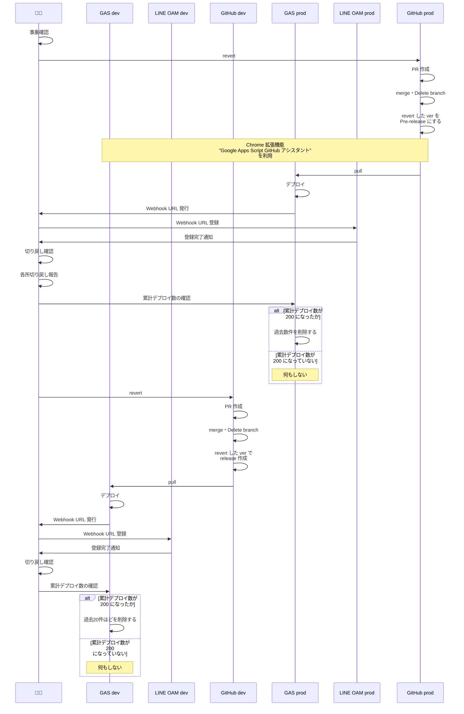

```mermaid
    sequenceDiagram
        participant 👩‍💻
        participant GAd as GAS dev
        participant LOAMd as LINE OAM dev
        participant Gid as GitHub dev

        participant GAp as GAS prod
        participant LOAMp as LINE OAM prod
        participant Gip as GitHub prod

        👩‍💻 ->> 👩‍💻 : 事象確認
        👩‍💻 ->> Gip : revert
        Gip ->> Gip : PR 作成
        Gip ->> Gip : merge・Delete branch
        Gip ->> Gip : revert した ver を<br>Pre-release にする

        Note over GAd, Gip : Chrome 拡張機能<br>"Google Apps Script GitHub アシスタント"<br>を利用
        Gip ->> GAp : pull
        GAp ->> GAp : デプロイ
        GAp ->> 👩‍💻 : Webhook URL 発行
        👩‍💻 ->> LOAMp : Webhook URL 登録
        LOAMp ->> 👩‍💻 : 登録完了通知
        👩‍💻 ->> 👩‍💻 : 切り戻し確認
        👩‍💻 ->> 👩‍💻 : 各所切り戻し報告

        👩‍💻 ->> GAp : 累計デプロイ数の確認
        alt 累計デプロイ数が<br>200 になったか
            GAp ->> GAp : 過去数件を削除する
        else 累計デプロイ数が<br>200 になっていない
            Note over GAp : 何もしない
        end

        👩‍💻 ->> Gid : revert
        Gid ->> Gid : PR 作成
        Gid ->> Gid : merge・Delete branch
        Gid ->> Gid : revert した ver で<br>release 作成

        Gid ->> GAd : pull
        GAd ->> GAd : デプロイ
        GAd ->> 👩‍💻 : Webhook URL 発行
        👩‍💻 ->> LOAMd : Webhook URL 登録
        LOAMd ->> 👩‍💻 : 登録完了通知
        👩‍💻 ->> 👩‍💻 : 切り戻し確認

        👩‍💻 ->> GAd : 累計デプロイ数の確認
        alt 累計デプロイ数が<br>200 になったか
            GAd ->> GAd : 過去20件ほどを削除する
        else 累計デプロイ数が<br>200 になっていない
            Note over GAd : 何もしない
        end
```